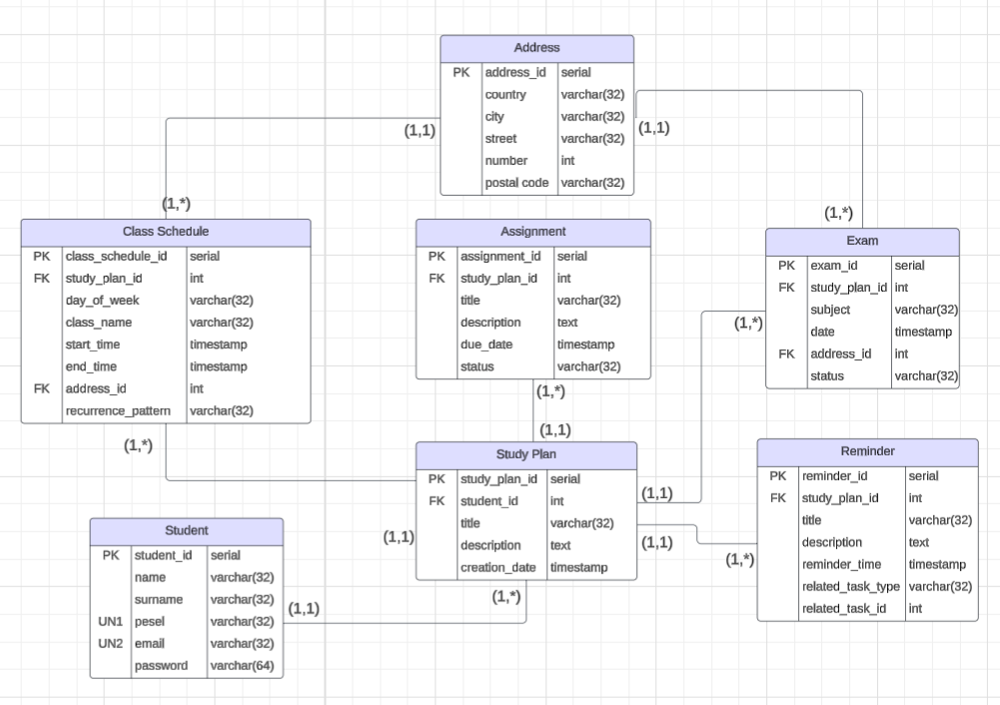

# 📚 Personalized Study Planner

&#x20;  &#x20;

## 📝 Overview

Personalized Study Planner is a **desktop application** built using **JavaFX** that helps students organize their study plans, track assignments, and manage exam schedules. The application uses **PostgreSQL** for data storage and is fully containerized with **Docker**.

## 📸 Screenshots

*(Add screenshots of the running application here)*

## 🛠️ Features

✅ Add, edit, and delete study plans ✅ Manage assignments and deadlines ✅ Track upcoming exams ✅ Database-backed persistence with PostgreSQL ✅ Modern UI with JavaFX ✅ Fully containerized with Docker

---

## 📌 Technologies Used

### **Programming Languages & Frameworks**

- **Java 17** – Main programming language
- **JavaFX** – UI framework for the desktop application
- **FXML** – XML-based UI layout for JavaFX

### **Database & Persistence**

- **PostgreSQL 15** – Relational database for storing study plans
- **JDBC** – Java Database Connectivity for database access

### **Build & Dependency Management**

- **Maven** – Handles dependencies and builds

### **Containerization & Deployment**

- **Docker** – Runs the JavaFX app and PostgreSQL in containers
- **Docker Compose** – Manages multi-container setup

### **Version Control & CI/CD**

- **Git & GitHub** – Version control
- **Jenkins (Optional)** – Continuous integration & deployment

---

## 📂 Project Structure

```
📦 PersonalizedStudyPlanner
├── 📁 src/main/java/org/example/personalizedstudyplanner
│   ├── 📁 controllers
│   ├── 📁 database
│   ├── 📁 models
│   ├── 📁 views
├── 📁 src/main/resources
│   ├── 📁 fxml
│   ├── 📁 images
├── 📄 pom.xml  # Maven dependencies
├── 📄 Dockerfile  # Builds the application container
├── 📄 docker-compose.yml  # Manages PostgreSQL + App
└── 📄 README.md  # Project documentation
```

---

## 🛠️ Installation & Setup

### **1️⃣ Prerequisites**

Ensure you have the following installed:

- **Java 17**
- **Maven**
- **Docker & Docker Compose**
- **Git**

### **2️⃣ Clone the Repository**

```sh
git clone https://github.com/yourusername/PersonalizedStudyPlanner.git
cd PersonalizedStudyPlanner
```

### **3️⃣ Build the Application**

```sh
mvn clean package
```

This will create a `.jar` file in the `target/` directory.

### **4️⃣ Run the Application (Without Docker)**

If you want to run the app locally without Docker, ensure **PostgreSQL** is installed and running.

```sh
java -jar target/PersonalizedStudyPlanner-1.0-SNAPSHOT.jar
```

### **5️⃣ Run the Application with Docker**

Ensure Docker is installed and running.

```sh
docker-compose up -d
```

This starts both **PostgreSQL** and the **JavaFX app** inside containers.

### **6️⃣ Check Running Containers**

```sh
docker ps
```

---

## 🛢️ Database Configuration

### **Database Connection Details**

| Property | Value                                |
| -------- | ------------------------------------ |
| Database | studyplanner                         |
| Username | admin                                |
| Password | admin123                             |
| Host     | `db` (Docker) or `localhost` (Local) |
| Port     | 5432                                 |

### **Entity Relationship Diagram (ERD)**

**

### **Modify Database Connection (If Needed)**

Edit `DatabaseUtil.java` to update the connection details if running without Docker.

---

## 🛠️ Stopping & Cleaning Up

To stop the running containers:

```sh
docker-compose down
```

To **remove all containers and delete database data**:

```sh
docker-compose down -v
```

---

## 🚀 Future Improvements

🔹 Add user authentication (login/register) 🔹 Export study plans to PDF 🔹 Cloud deployment options

---

## 📝 License

This project is licensed under the MIT License.

---

## 💡 Contributing

Contributions are welcome! Feel free to submit a pull request.

---

## 📧 Contact

For any questions, reach out at: [**your-email@example.com**](mailto\:your-email@example.com)

